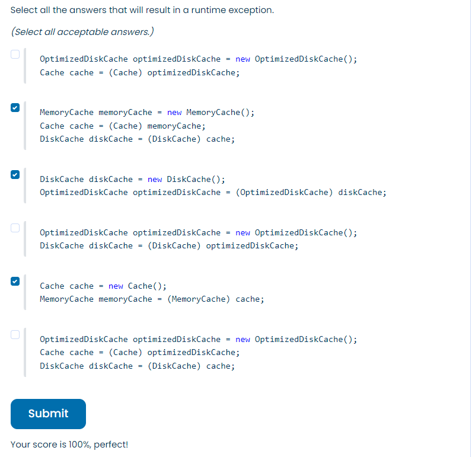

## A company is designing the class hierarchy for various cache implementations:

```JAVA
public class Cache {}

public class DiskCache extends Cache {}

public class MemoryCache extends Cache {}

public class OptimizedDiskCache extends DiskCache {}
````
Select all the answers that will result in a runtime exception.
