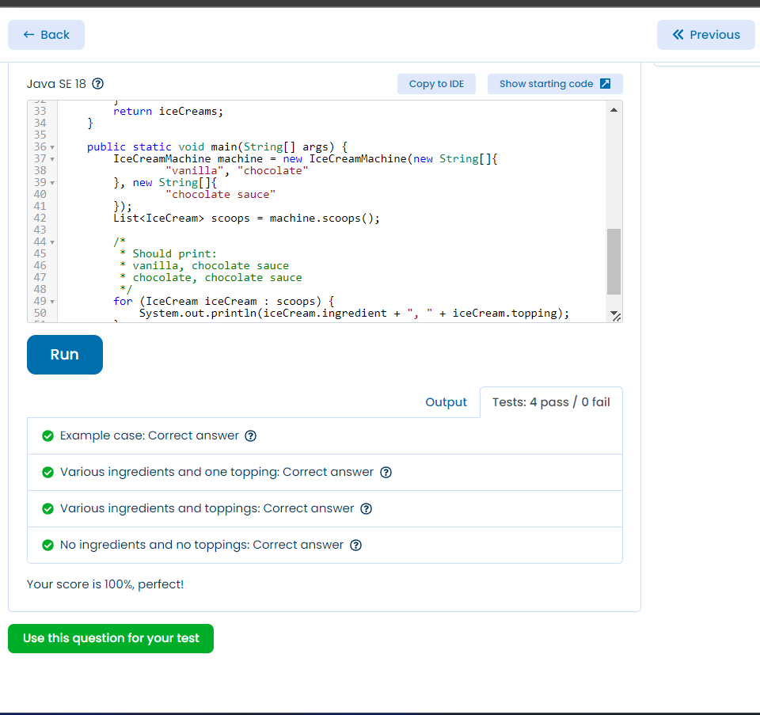

```java
package com.crystal.tests.ex3_IceCreamMachine;

import java.util.Arrays;
import java.util.List;
import java.util.stream.Collectors;


public class IceCreamMachine {
    public String[] ingredients;
    public String[] toppings;

    public static class IceCream {
        public String ingredient;
        public String topping;

        public IceCream(String ingredient, String topping) {
            this.ingredient = ingredient;
            this.topping = topping;
        }
    }

    public IceCreamMachine(String[] ingredeints, String[] toppings) {
        this.ingredients = ingredeints;
        this.toppings = toppings;
    }

    public List<IceCream> scoops() {
        return Arrays.stream(ingredients)
                .flatMap(s -> Arrays.stream(toppings)
                        .map(s1 -> new IceCream(s, s1)))
                .collect(Collectors.toList());
    }

    public static void main(String[] args) {
        IceCreamMachine machine = new IceCreamMachine(new String[]{
                "vanilla", "chocolate"
        }, new String[]{
                "chocolate sauce"
        });
        List<IceCream> scoops = machine.scoops();

        /*
         * Should print:
         * vanilla, chocolate sauce
         * chocolate, chocolate sauce
         */
        for (IceCream iceCream : scoops) {
            System.out.println(iceCream.ingredient + ", " + iceCream.topping);
        }
    }
}

```
