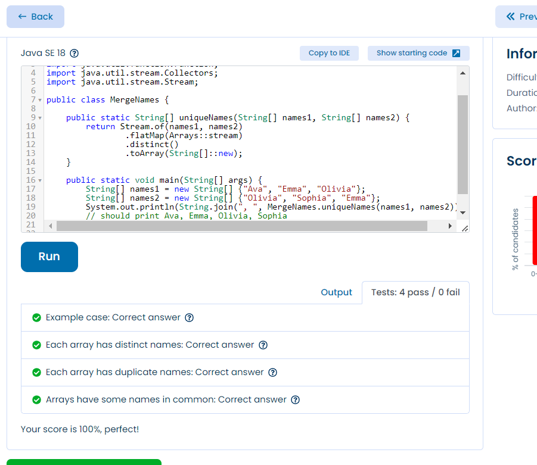

```java
package com.crystal.tests.ex4_marge_names;

import java.sql.Array;
import java.util.Arrays;
import java.util.function.Function;
import java.util.stream.Collectors;
import java.util.stream.Stream;

public class MergeNames {

    public static String[] uniqueNames(String[] names1, String[] names2) {
        return Stream.of(names1, names2)
                .flatMap(Arrays::stream)
                .distinct()
                .toArray(String[]::new);
    }

    public static void main(String[] args) {
        String[] names1 = new String[] {"Ava", "Emma", "Olivia"};
        String[] names2 = new String[] {"Olivia", "Sophia", "Emma"};
        System.out.println(String.join(", ", MergeNames.uniqueNames(names1, names2))); 
        // should print Ava, Emma, Olivia, Sophia
    }
}
```


