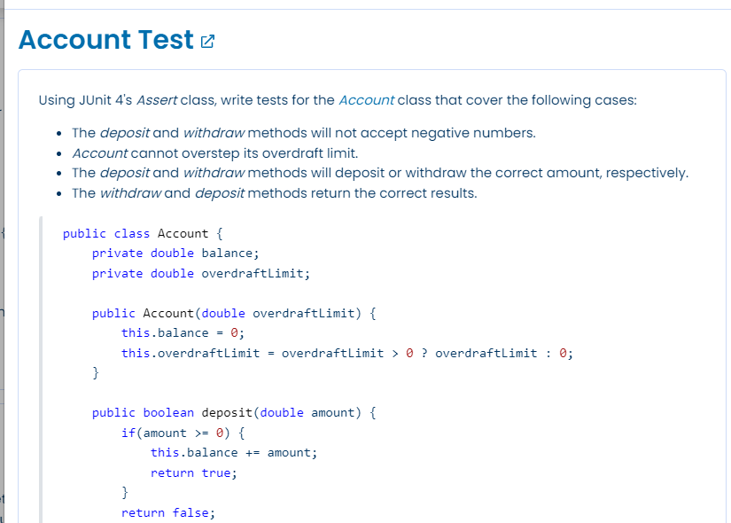
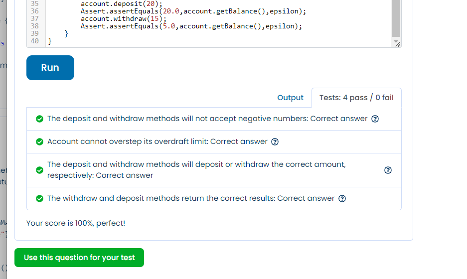

```java

import org.junit.Assert;
import org.junit.Test;

public class AccountTest {
    private double epsilon = 1e-6;

    @Test
    public void accountCannotHaveNegativeOverdraftLimit() {
        Account account = new Account(-20);

        Assert.assertEquals(0d,account.getOverdraftLimit(),epsilon);
    }
    @Test
    public void accountCannotHaveNegativeDepositAndWithdraw() {
        Account account = new Account(20);

        Assert.assertFalse(account.withdraw(-20));
        Assert.assertFalse(account.deposit(-10));
    }
    @Test
    public void accountCannotOverstepOverdraftLimit(){
        Account account = new Account(10);
        Assert.assertFalse(account.withdraw(20));
    }
    @Test
    public void accountDepositAndWithdrawCorrectAmount(){
        Account account = new Account(10);
        Assert.assertTrue(account.deposit(20));
        Assert.assertTrue(account.withdraw(15));
    }
    @Test
    public void accountDepositAndWithdrawCorrectAmountReturned(){
        Account account = new Account(10);
        account.deposit(20);
        Assert.assertEquals(20.0,account.getBalance(),epsilon);
        account.withdraw(15);
        Assert.assertEquals(5.0,account.getBalance(),epsilon);
    }
}
```